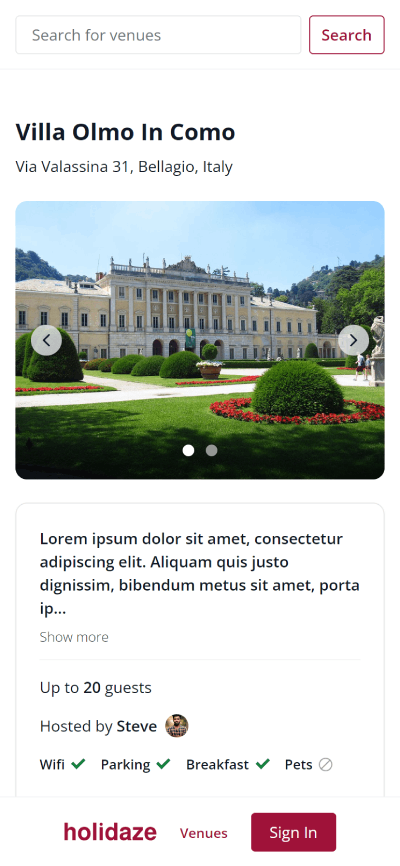
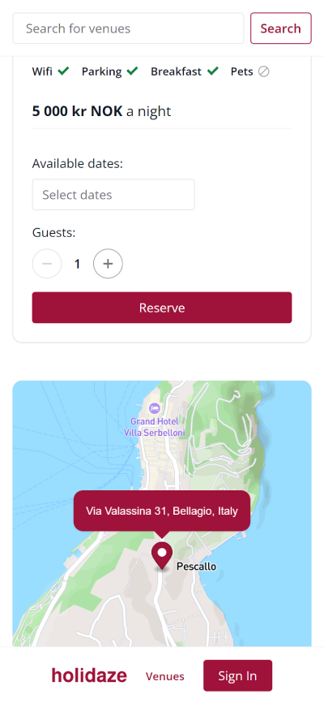
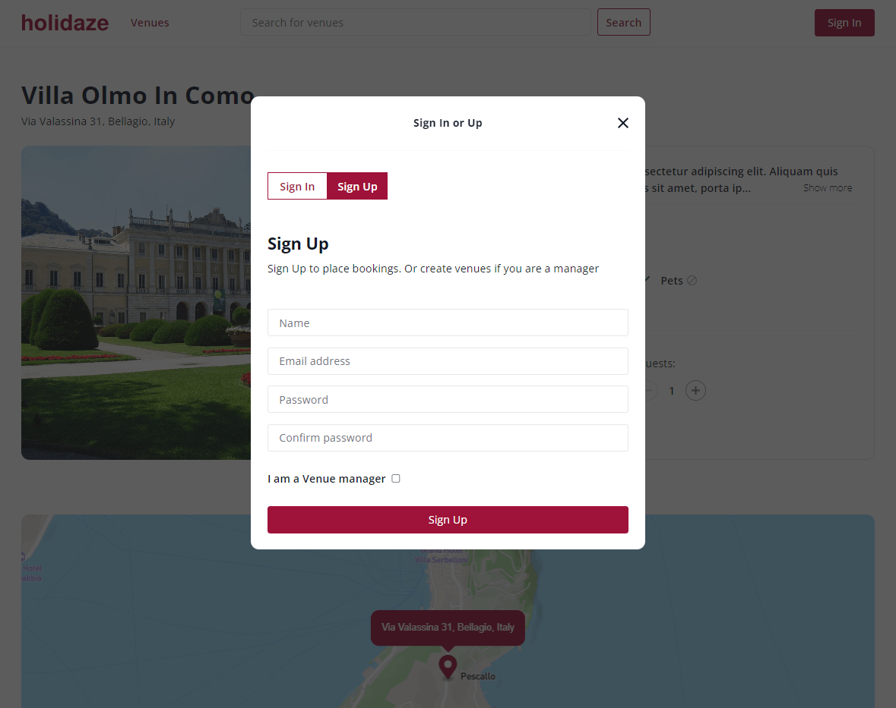

# Holidaze - Project Exam 2

An accommodation booking site where users can sign up and place bookings on venues, and create venues when signing up with a manager account.

#### Screenshots mobile and desktop

<div>
  
  &nbsp&nbsp&nbsp 
 
</div>



## Description

Using the official API documentation, take the skills learned over the last two years, and take on an extensive
project where the finished product should reflect my general development capabilites, including visual and technical skills,
and build a modern front-end accommodation booking application.

This project has the following required User Stories:

- A user may view a list of Venues
- A user may search for a specific Venue
- A user may view a specific Venue page by id
- A user may view a calendar with available dates for a Venue
- A user with a stud.noroff.no email may register as a customer
- A registered customer may create a booking at a Venue
- A registered customer may view their upcoming bookings
- A user with a stud.noroff.no email may register as a Venue manager
- A registered Venue manager may create a Venue
- A registered Venue manager may update a Venue they manage
- A registered Venue manager may delete a Venue they manage
- A registered Venue manager may view bookings for a Venue they manage
- A registered user may login
- A registered user may update their avatar
- A registered user may logout

## Built With

- [Vite](https://vitejs.dev/)
- [React](https://reactjs.org/)
- [Tailwind CSS](https://tailwindcss.com/)
- [Mapbox](https://www.mapbox.com/)
- [React Datepicker](https://reactdatepicker.com/)
- [date-fns](https://date-fns.org/)

## Getting Started

### Installing

**Note:**
<br>
This project uses [Mapbox](https://www.mapbox.com/) for address autofill and displaying of venue location.<br>
Create Venue form and Venues with coordinates will not work when running this project locally
since my Mapbox access token is private.<br>
To see the Mapbox functionality, visit the deployed site at [Holidaze](https://project-exam-2-hreinn.netlify.app/)<br>
Or, sign up with [Mapbox](https://www.mapbox.com/) (free account), create/copy your access token, create a file called **.env.production** in project root with the contents of **VITE_ACCESS_TOKEN=YOUR_ACCESS_TOKEN**

1. Clone the repo:

```bash
git clone git@github.com:baresi687/project-exam-2.git
```

2. Install the dependencies:

```
npm install
```

### Running

To run the app, run the following commands:

```bash
npm run build
npm run preview
```

### Testing

**Note:**<br>
Mapbox access token is required for the following test:<br> **Sign In, create Venue, and delete Venue**

#### Cypress tests

- Sign In form validation. Show error messages.
- Sign In with invalid credentials. Show error message from the API.
- Sign In and Out. Display/hide Sign In button or Profile menu.
- Sign In, create Venue, and delete Venue

To run Cypress, make sure the local server is running.

```bash
npm run preview
```

And then in another terminal:

```bash
npm run cypress:open
```

Once Cypress has opened, select E2E testing, choose browser and click 'Start E2E Testing in browser'<br>
Then you should see a list of the four tests where you can run them individually.

To run all tests in the terminal without Cypress GUI:

```bash
npx cypress run
```

## Deployed site

[Holidaze](https://project-exam-2-hreinn.netlify.app/)

## Contact

[My LinkedIn page](https://www.linkedin.com/in/hreinn-gylfason-b9a48521a/)
